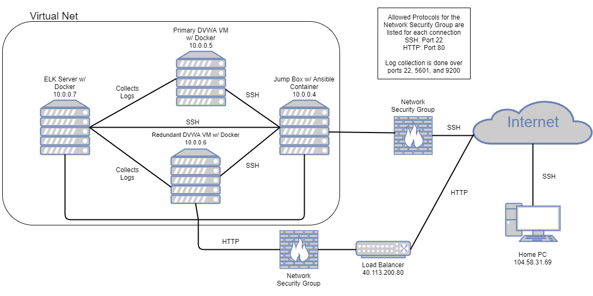

## Automated ELK Stack Deployment

The files in this repository were used to configure the network depicted below.

These files have been tested and used to generate a live ELK deployment on Azure. They can be used to either recreate the entire deployment pictured above. Alternatively, select portions of the filebeat-configuration.yml file may be used to install only certain pieces of it, such as Filebeat.

This document contains the following details:
- Description of the Topologu
- Access Policies
- ELK Configuration
  - Beats in Use
  - Machines Being Monitored
- How to Use the Ansible Build

### Description of the Topology

The main purpose of this network is to expose a load-balanced and monitored instance of DVWA, the D*mn Vulnerable Web Application.

Load balancing ensures that the application will be highly available, in addition to restricting arbitrary public access to the network.

Integrating an ELK server allows users to easily monitor the vulnerable VMs for changes to the file system and system metrics.

The configuration details of each machine may be found below.

| Name     | Function | IP Address | Operating System |
|----------|----------|------------|------------------|
| Jump Box | Gateway  | 10.0.0.4   | Linux            |
| Primary DVWA VM | Primary hosting of DVWA | 10.0.0.5 | Linux |
| Redundant DVWA VM | Redundancy in case primary host fails | 10.0.0.6 | Linux |
| ELK Server | System log collection of DVWA hosts | 10.0.0.7 | Linux |
| Load Balancer | Web traffic balancing to DVWA hosts | 40.113.200.80 | Linux |

### Access Policies

The machines on the internal network are not exposed to the public Internet. 

Only the load balancing machine can accept connections from the Internet. Access to this machine is only allowed from the following IP addresses:
- 104.58.31.69

Machines within the network can only be accessed by the jump box (private IP 10.0.0.4, dynamic public IP).

A summary of the access policies in place can be found in the table below.

| Name     | Publicly Accessible | Allowed IP Addresses |
|----------|---------------------|----------------------|
| Jump Box | No | 104.58.31.69 |
| Load Balancer | No | 104.58.31.69 |
| ELK Server | No | 104.58.31.69 |

### Elk Configuration

Ansible was used to automate configuration of the ELK machine. No configuration was performed manually, which is advantageous because this means that small changes in the configuration can be performed and deployed as painlessly as possible.

The playbook implements the following tasks:
- Installs Docker, Pip, and docker Python module
- Increases the virtual memory
- Downloads and luanches the ELK Docker conatiner (sebp/elk)

The following screenshot displays the result of running `docker ps` after successfully configuring the ELK instance.

### Target Machines & Beats
This ELK server is configured to monitor the following machines:
- 10.0.0.5
- 10.0.0.6

Since beat installation was a "Bonus" objective in the project, this is treated as a future effort.

### Using the Playbook
In order to use the playbook, you will need to have an Ansible control node already configured. Assuming you have such a control node provisioned: 

SSH into the control node and follow the steps below:
- Copy the install-elk.yml file to /etc/ansible/files/install-elk.yml within the ansible container.
- Update the /etc/ansible/hosts file to have the ELK server private IP under `[elkservers]` and the filebeat machines' private IP addresses under `[webservers]`.
- Run the playbook, and navigate to your ELK server's public IP address over port 5601 from the browser to confirm the ELK server is running. 

_TODO: Answer the following questions to fill in the blanks:_
- _Which file is the playbook? Where do you copy it?_
- _Which file do you update to make Ansible run the playbook on a specific machine? How do I specify which machine to install the ELK server on versus which to install Filebeat on?_
- _Which URL do you navigate to in order to check that the ELK server is running?
